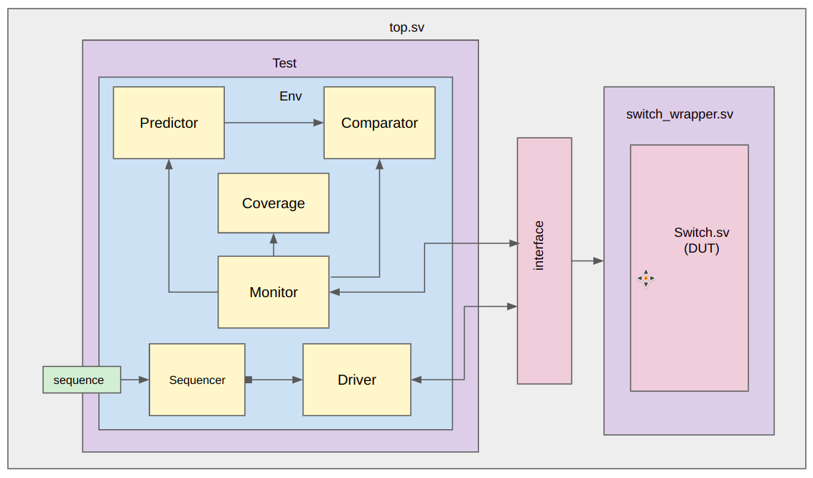
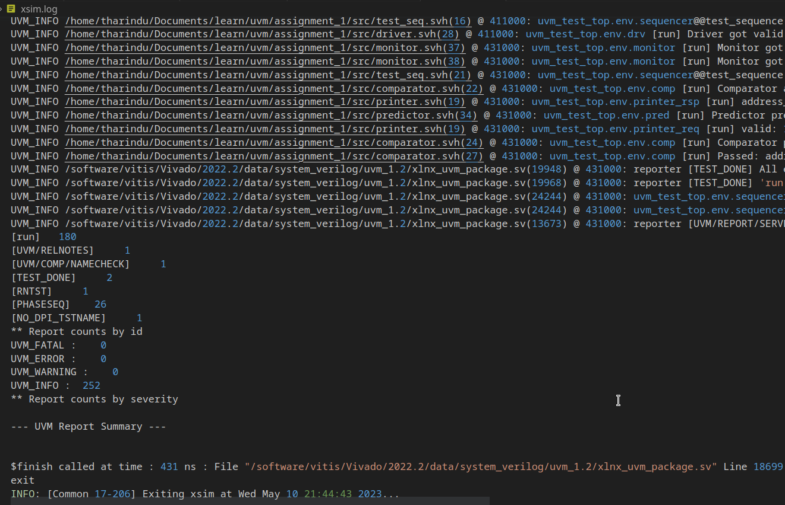
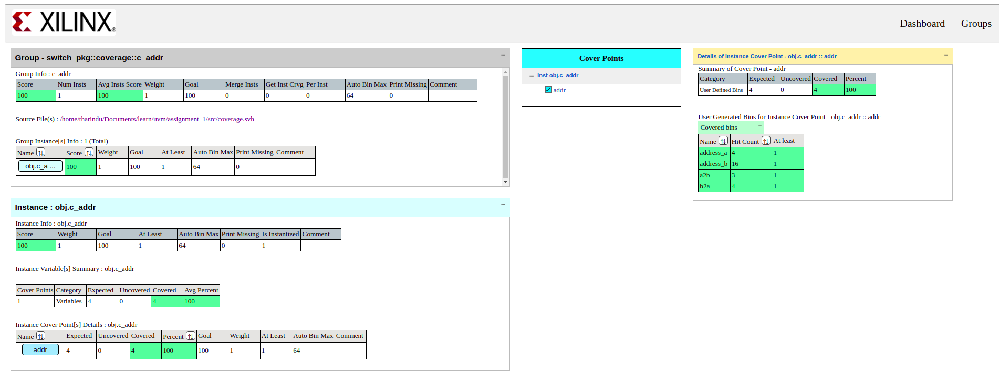

# UVM Test Bench for simple switch module

- This is a UVM test bench for a simple switch module (DUT) designed for learning purposes. 
- This test bench covers following things
    - How to connect driver, DUT interface, sequencer, monitor etc. together
    - UVM environment
    - UVM coverage
    - UVM verbosity

## DUT (design under test)

- DUT is a combinational [switch module](src/switch.sv) generated by ChatGPT
    - Input interface has parameterized `data` and `address` inputs. 
    - There are 2 output interfaces (`A` and `B`) similar to the input interface.
    - Based on a `address-division` value, the input will be routed to `A` or `B` output.

## UVM test bench architecture

<p align="left">
  
</p>

## How to run

- This UVM testbench is designed to be run in **vivado** using `batch mode`.
    ```
    source <path>/Vivado/<version>/settings64.sh
    cd <path>/UVM_switch_test
    vivado -mode batch -source ./run.tcl
    ```
    > **Note**
    > UVM should be setup first to run the testbench. ([Reference](https://support.xilinx.com/s/article/1070861?language=en_US))

## Results

- The outputs will be in `<path>/UVM_switch_test/work` folder.
    - UVM simulation log : `work/xsim.log`
    - Coverage report    : `work/coverage/dashboard.html`

<p align="left">
  
</p>
<p align="left">
  
</p>